  

`[I][System] User: Ayush Mishra | ayush506x` 
`[I][System] Arch: B.Tech CSE (AI & ML), LPU '29` 
`[I][System] Role: Edge AI & Embedded Systems Engineer` 
`[I][Target] Req : Summer 2028 Internships (NVIDIA, Qualcomm, Intel)`

---

### `[I][Mem] : Dumping project pointers...`

**`0x100` [Plant Disease & Health Monitor](https://github.com/ayush506x/plant-disease-project-using-iot)**
* `[Sys]` TensorFlow Lite on ESP32 + soil/temp/humidity sensors + I2C OLED.
* `[Out]` Classified diseases at [FILL]% accuracy. Model size: [FILL] KB.

**`0x104` Offline Personal AI Assistant (WIP)**
* `[Sys]` Vosk/whisper.cpp tiny -> Intent matching -> Piper TTS -> Hardware control.
* `[Out]` Zero cloud dependency. Target footprint: [FILL] MB. Latency: [FILL] ms.
* `[Nxt]` Model compression and quantization for edge targets.

**`0x108` ESP32-CAM Face Detection & Access Control**
* `[Sys]` ESP32-CAM edge inference.
* `[Out]` Real-time access control barrier actuation under [FILL] KB RAM, [FILL] fps.

**`0x10C` [Neural Nets from Scratch](https://github.com/ayush506x/deep-learning-journey)**
* `[Sys]` Micrograd-style autograd + bigram character model.
* `[Out]` Trained [FILL]-parameter model in [FILL]s. Zero external ML framework dependencies.

**`0x110` AI Queue Management System**
* `[Sys]` Dual IR sensors, servo barriers, traffic light logic.
* `[Out]` Hardware-managed queue state machine, max throughput [FILL] pax/min.

**`0x114` Multi-Sensor Fire & Gas Alert**
* `[Sys]` MQ gas, DHT22, flame IR integration.
* `[Out]` Alert transmission within [FILL] ms of threshold breach.

**`0x118` RFID Vending Controller**
* `[Sys]` MFRC522 + dual servos.
* `[Out]` Processed [FILL] transactions/hour, state persistence in EEPROM.

**`0x11C` Keypad + Solenoid Smart Lock**
* `[Sys]` Matrix keypad interrupt driver.
* `[Out]` Sub-[FILL] ms scan-to-actuation latency.

---

### `[I][Net] : Establishing connections...`

`[INF]` GitHub: [@ayush506x](https://github.com/ayush506x) 
`[INF]` LinkedIn: [in/ayush-mishra-[FILL]](https://linkedin.com/in/[FILL]) 
`[INF]` Email: [[FILL]@gmail.com](mailto:[FILL]@gmail.com)

`[I][System] Idle. Waiting for interrupts...`
