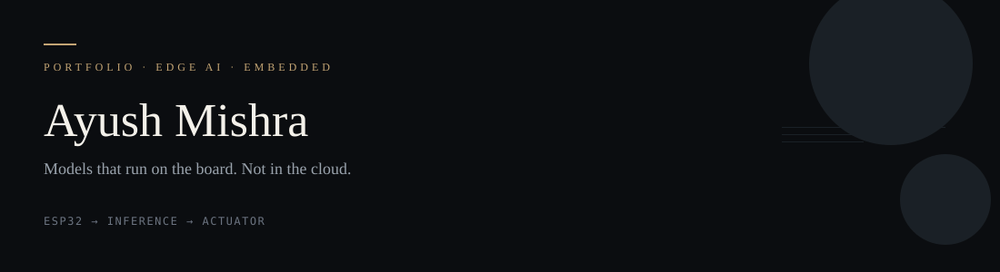

  
   
  
  
  
  
   
  

---
**Ayush Mishra** is an Edge AI engineer building systems that infer on the device — ESP32, ESP32-CAM, C++ firmware, sensors, actuators. CSE (AI & ML), Lovely Professional University, 2025–2029.
## About
[Work](#selected-work) · [Approach](#approach) · [Stack](#stack) · [Info](#info) · [LinkedIn](https://linkedin.com/in/ayush5606) · [Email](mailto:mishraji112008@gmail.com)
I'm a Computer Science Engineering student specializing in **AI & ML** at Lovely Professional University, working as an **Edge AI Engineer**. I build and deploy AI systems that run directly on embedded hardware, with zero cloud dependency.

My work spans real-time face detection on ESP32-CAM, AI-driven queue management, and on-device plant disease diagnostics — low-latency inference in the field, not training runs in a notebook. Deep learning plus C++ on Arduino and ESP: the last mile is getting a model off a GPU and onto a chip that ships.
## Selected Work
---
## Profile
<table>
  <tr>
    <td width="50%" valign="top">
      <h3>Education</h3>
      

        <b>Degree</b> — B.Tech, CSE (AI & ML) 
        <b>University</b> — Lovely Professional University 
        <b>Batch</b> — August 2025 → September 2029 
        <b>Location</b> — Phagwara, Punjab, India
      

    <td width="72" valign="top">
01
</td>
    <td valign="top">
      <h3>Face Detection & Access Control</h3>
      
ESP32-CAM · on-device vision · security

      
Real-time face detection on the camera board. Access decisions stay local — no cloud round-trip in the detect loop.

      
<a href="https://github.com/ayush506x/ESP32-Face-Cam-Detection-and-Acess-Control">View project →</a>

    </td>
    <td width="50%" valign="top">
      <h3>Focus Areas</h3>
      

        <b>Primary</b> — Edge AI, On-device Inference 
        <b>Hardware</b> — ESP32, ESP32-CAM, Embedded Vision 
        <b>Applied</b> — IoT + Sensor Fusion 
        <b>Core</b> — Deep Learning, Computer Vision
      

    </td>
  </tr>
  <tr>
    <td width="50%" valign="top">
      <h3>Currently Working On</h3>
      

        🟢 Offline Personal AI Assistant (capstone) 
        🟢 Edge inference optimization for embedded vision 
        🟢 Neural nets from scratch (Zero to Hero) 
        🔵 Custom hardware assembly & embedded deployment
      

    <td valign="top">
02
</td>
    <td valign="top">
      <h3>Plant Disease & Field Monitor</h3>
      
ESP32 · TensorFlow · soil + climate sensors

      
Moisture, temperature, and humidity on OLED, with disease classification running on the microcontroller in the field.

      
<a href="https://github.com/ayush506x/plant-disease-project-using-iot">View project →</a>

    </td>
    <td width="50%" valign="top">
      <h3>Principles</h3>
      

        <b>Delivery</b> — Shipped systems over tutorials 
        <b>Practice</b> — Daily commits over weekend sprints 
        <b>Mindset</b> — Deploy on real hardware, not just notebooks 
        <b>Goal</b> — Edge AI / embedded ML roles & internships
      

    </td>
  </tr>
</table>
> *"Don't just train a model. Ship it — on-device, in real time."*
---
## Projects
**Edge & embedded systems** — from bare-metal C++ to on-device inference.
<table>
  <tr>
    <td width="50%" valign="top">
      <h3>Advanced Face Detection — ESP32-CAM</h3>
      
Real-time facial detection and access control running inference on ESP32-CAM. Fully on-device — no cloud round-trip.

      
      
        
      
    <td valign="top">
03
</td>
    <td valign="top">
      <h3>Queue Management System</h3>
      
C++ · dual IR · servo barriers · traffic lights

      
On-device flow logic for capacity, gates, and signals. The controller does not wait on Wi-Fi to move a barrier.

    </td>
    <td width="50%" valign="top">
      <h3>AI-Powered Queue Management</h3>
      
Capacity tracking with dual IR sensors, servo barriers, and traffic lights. Flow algorithms run on-device for gate control.

      
      
    </td>
  </tr>
  <tr>
    <td width="50%" valign="top">
      <h3>Multi-Sensor Fire & Gas Alert</h3>
      
MQ gas, DHT22, and flame IR fused on the board. Relay and buzzer alerts for leaks and fire with no network required.

      
      
    <td valign="top">
04
</td>
    <td valign="top">
      <h3>Fire & Gas Edge Alert</h3>
      
MQ gas · DHT22 · flame IR · relay / buzzer

      
Local sensor fusion for leaks and fire. Alerts fire from the board with no network in the safety path.

    </td>
    <td width="50%" valign="top">
      <h3>Plant Disease & Health Monitor</h3>
      
Soil moisture, temperature, and humidity on OLED/I2C, plus TensorFlow disease classification on ESP32.

      
        
      
    </td>
  </tr>
  <tr>
    <td width="50%" valign="top">
      <h3>Smart RFID Vending Controller</h3>
      
C++ state machine for MFRC522 auth, timer logic, dual servo dispensing, push-button matrix, and LCD.

      
      
        
      
    <td valign="top">
05
</td>
    <td valign="top">
      <h3>RFID Vending Controller</h3>
      
Arduino C++ · MFRC522 · dual servo · LCD

      
Hardware state machine: card auth, timers, and dispense. Firmware, not a web dashboard with a motor on the side.

      
<a href="https://github.com/ayush506x/smart-rfid-vending-controller">View project →</a>

    </td>
    <td width="50%" valign="top">
      <h3>Edge Access Control Smart Lock</h3>
      
Matrix keypad, solenoid, relay, and servo. Self-contained C++ password verification and unlock loop.

      
      
    </td>
  </tr>
  <tr>
    <td width="50%" valign="top">
      <h3>Neural Network Fundamentals</h3>
      
Autograd backpropagation engines and character-level language models from scratch in Python.

      
        
      
    <td valign="top">
06
</td>
    <td valign="top">
      <h3>Edge Smart Lock</h3>
      
keypad · solenoid · relay · servo

      
Self-contained password verify and unlock loop. Physical security that still works when the internet does not.

    </td>
    <td width="50%" valign="top">
  </tr>
  <tr>
    <td valign="top">
07
</td>
    <td valign="top">
      <h3>Offline Personal AI Assistant</h3>
      
Capstone — fully offline assistant. No API calls, no cloud. Local hardware only.

      
      
      
capstone · in progress · no API

      
Assistant that runs on local hardware. Weights, inference, and privacy stay on the machine.

    </td>
  </tr>
  <tr>
    <td width="50%" valign="top">
      <h3>Data Structures & Algorithms</h3>
      
Data structures and algorithms implemented in C++.

      
        
      
    <td valign="top">
08
</td>
    <td valign="top">
      <h3>Neural Nets from Scratch</h3>
      
PyTorch · autograd · small language models

